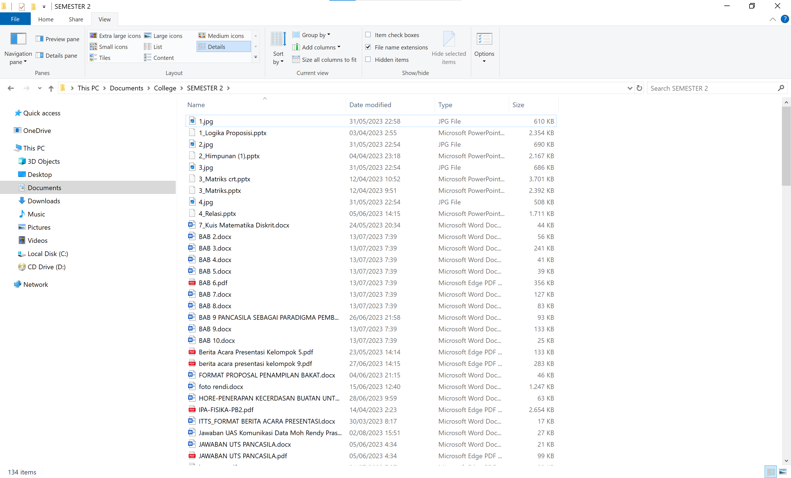
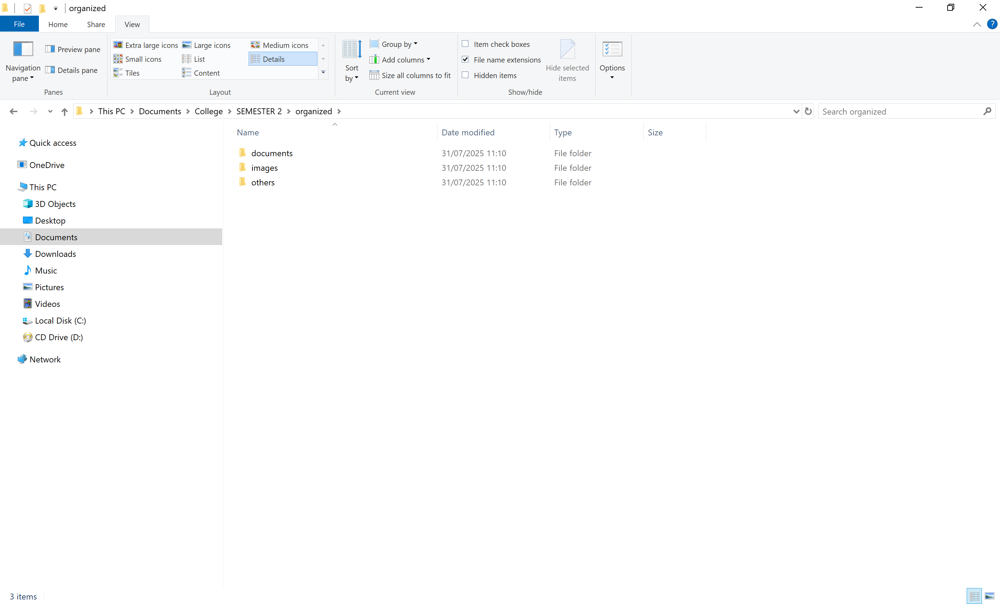
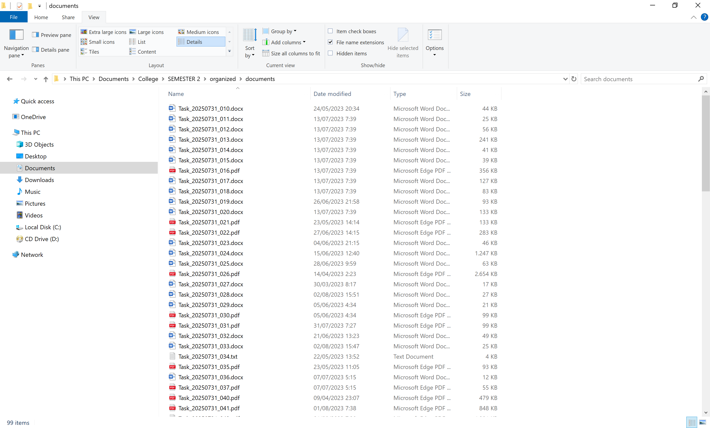

# Bulk File Renamer & Organizer

This Python-powered Bulk File Renamer and Organizer tidies up 
messy folders for design teams, schools, or agencies. 
It renames files with a sleek, timestamped format and sorts them 
into neat subfolders by type—images, documents, videos, and 
more—in just a few clicks!

## Before

  

## After

  
  

